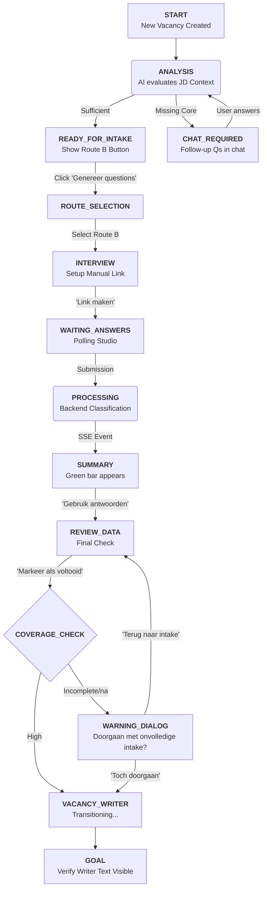

# Project Analysis: Intake-to-Writer Flow Mapping

This document provides a detailed mapping of every possible logical path and state transition within the Vacancy Wizard intake-to-writer workflow, based on a comprehensive study of the Studio (frontend) and Backend services.

## Logic Overview

The intake process is governed by a state machine managed via `IntakeStepV2` (frontend) and `PreProfileData.currentStep` (backend). Each transition is often triggered by AI processing or direct user action.

### 1. State Machine Definition

| Step (`IntakeStepV2`) | Name | Trigger | Typical UI Actions |
| :--- | :--- | :--- | :--- |
| `START` | Initial Phase | Vacancy Creation | "Genereer intake vragen" |
| `ANALYSIS` | AI Processing | JD Analysis | Progress overlays |
| `ROUTE_SELECTION` | Path Choice | Analysis Success | Option selection (Route B) |
| `INTERVIEW` | Data Gathering | Route B Selected | "Link maken", "Open Form" |
| `WAITING_ANSWERS` | Form Process | Form Opened | Green bar polling |
| `SUMMARY` | Review Phase | Answers Submitted | "Bekijk antwoorden", "Markeer als voltooid" |
| `COMPLETE` | Finalization | "Toch doorgaan" | Redirection to Writer |

---

## Complete Flow Chart (Expected Scenarios)

---

## Detailed Logic Paths & Outcomes

### Path A: The "Perfect" JD Path
1. **Input**: Highly detailed JD.
2. **AI Action**: Direct classification to "Bulk" or "Regular".
3. **Outcome**: Skips many clarifying questions; "Genereer intake vragen" is enabled almost instantly.

### Path B: The "Route B" Happy Path (Automated Test Focus)
1. **Input**: Minimal JD + manual answers.
2. **AI Action**: Generates 18 standard hiring manager questions.
3. **Manual Action**: "Formulierlink aanmaken" -> Open link.
4. **Form Submit**: Fills "na" for all.
5. **Outcome**: Backend processes answers in ~10-30s; SSE event updates Studio state to `SUMMARY`.

### Path C: The "Incomplete Data" Warning
1. **Condition**: Large gaps remain after form submission (`viabilityScore < 50`).
2. **Trigger**: User clicks "Markeer als voltooid".
3. **Outcome**: UI triggers `ContinueAnywayDialog`.
4. **Resolution**: `ContinueAnywayDialog.onContinue` -> Moves to `COMPLETE`.

### Path D: The "Self-Healing" Scenarios (Future Coverage)
1. **Scenario**: Button not enabled due to pipeline lock.
2. **Action**: Polling refresh button until backend releases lock.

---

## Logging Strategy for E2E Scripts

Each execution step in `happy-path.spec.ts` must use the following logging format for traceability:

`[HAPPY-PATH-PHASE][HH:MM:SS] <Step Name>: <Specific Action>`

**Critical points for logging**:
- Login Completion.
- SSE Event reception for "Answers Received".
- Detection and click of the "Toch doorgaan" dialog.
- Final transition text detection.

*Analysis Date: 2026-03-30*
*Stored in: archived_analysis*
